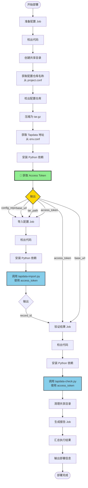

# Tapdata 配置部署文档

## 📖 概述

自动化部署配置到 Tapdata 平台，支持多环境、多项目分组。

---

## 🌍 支持的环境

- `dev` - 开发环境
- `lpt` - 测试环境
- `preprod` - 预生产环境
- `prod` - 生产环境

---

## 📦 支持的项目分组

- `patient` - 患者端项目
- `hospital` - 医院端项目

---

## 🚀 使用方式

1. 进入 GitHub Actions 页面
2. 选择 "tapdata配置部署" workflow
3. 点击 "Run workflow"
4. 选择环境和项目分组
5. 点击 "Run workflow" 开始执行

---

## ⚙️ 配置文件说明

### 1. 环境配置 (`conf/env.conf`)

定义各环境的 Tapdata 服务地址。

**格式：** `环境=Tapdata地址`

**示例：**
```properties
dev=http://dev.tapdata.com:3030
lpt=http://111.229.51.170:3030
preprod=http://preprod.tapdata.com:3030
prod=http://prod.tapdata.com:3030
```

### 2. 项目配置 (`conf/project.conf`)

定义项目分组与配置仓库的映射关系。

**格式：** `项目分组=仓库名称`

**示例：**
```properties
patient=tapdata/ha-cicd-patient
hospital=tapdata/ha-cicd-hospital
```

---

## 🛠️ 脚本说明

### 1. tapdata_utils.py

**功能：** Tapdata 工具模块，提供共享函数

**主要函数：**
- `get_access_token(base_url)`: 获取 Tapdata access_token

**特点：**
- 被其他脚本导入使用
- 统一的 token 获取逻辑
- 完整的错误处理

### 2. tapdata-get-token.py

**功能：** 获取 Access Token 并输出到标准输出

**使用方式：**
```bash
python scripts/tapdata-get-token.py <BASE_URL>
```

**参数：**
- `BASE_URL`: Tapdata 服务地址

**输出：**
- stdout: access_token（用于 shell 捕获）
- stderr: 日志信息

### 3. tapdata-import.py

**功能：** 导入配置到 Tapdata 平台

**主要步骤：**
1. 验证输入参数
2. 上传配置 tar 包
3. 返回导入任务 record_id

**使用方式：**
```bash
python scripts/tapdata-import.py <BASE_URL> <ACCESS_TOKEN> <TAR_FILE>
```

**参数：**
- `BASE_URL`: Tapdata 服务地址
- `ACCESS_TOKEN`: Tapdata 访问令牌
- `TAR_FILE`: 配置 tar 包路径

### 4. tapdata-check.py

**功能：** 检查 Tapdata 导入任务状态

**主要步骤：**
1. 验证输入参数
2. 循环检查导入状态（每5秒一次）
3. 处理不同状态：importing（导入中）、completed（成功）、failed（失败）
4. 格式化输出错误信息

**使用方式：**
```bash
python scripts/tapdata-check.py <BASE_URL> <ACCESS_TOKEN> <RECORD_ID>
```

**参数：**
- `BASE_URL`: Tapdata 服务地址
- `ACCESS_TOKEN`: Tapdata 访问令牌
- `RECORD_ID`: 导入任务 ID

---

## 📋 工作流程

以 Tapdata 配置部署为例：



### 详细步骤说明

**1. 准备配置 (prepare)**
- 检出当前仓库代码
- 创建共享目录
- 获取配置仓库名称（从 project.conf）
- 检出配置仓库代码
- 压缩配置仓库为 tar.gz
- 获取 Tapdata 地址（从 env.conf）
- 安装 Python 依赖
- 🔑 获取 Access Token（一次性获取，传递给后续 jobs）
- **输出**: `config_repo`, `base_url`, `tar_path`, `access_token`

**2. 导入配置 (import)**
- 检出当前仓库代码
- 安装 Python 依赖
- 调用 `tapdata-import.py`
  - 接收 `access_token`（来自 prepare job）
  - 上传 tar 文件
  - 返回 `record_id`
- **输出**: `record_id`

**3. 验证结果 (verify)**
- 检出当前仓库代码
- 安装 Python 依赖
- 调用 `tapdata-check.py`
  - 接收 `access_token`（来自 prepare job）
  - 接收 `record_id`（来自 import job）
  - 循环检查导入状态（每5秒一次）
- 清理共享目录

**4. 生成报告 (report)**
- 汇总执行结果
- 输出部署信息
- 显示相关链接

---

## ⚠️ 注意事项

1. **权限要求**
   - **必须配置 PAT Token**：需要创建 `PAT_TOKEN` Secret 用于访问配置仓库
     - 默认的 `GITHUB_TOKEN` 只有当前仓库权限，无法访问其他仓库
     - 详细配置步骤请参考：[PAT Token 配置指南](PAT-TOKEN-SETUP.md)
   - 确保 self-hosted runner 有文件系统读写权限

2. **配置文件**
   - 确保 `env.conf` 中配置了所有环境的 Tapdata 地址
   - 确保 `project.conf` 中配置了所有项目分组的仓库名称

3. **超时设置**
   - 准备配置：5分钟
   - 导入配置：20分钟
   - 验证结果：5分钟
   - 生成报告：2分钟

4. **错误处理**
   - 导入失败时会打印详细的错误信息
   - 共享目录会在最后一个 job 完成后自动清理
   - 可以通过 GitHub Actions 界面重试失败的 job

---

## 🔗 相关文档

- [如何添加新的项目分组](add-new-group.md)
- [如何添加新的Tapdata环境](add-new-env.md)
- [PAT Token 配置指南](PAT-TOKEN-SETUP.md)
